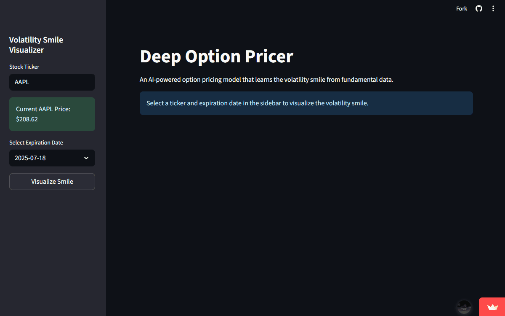
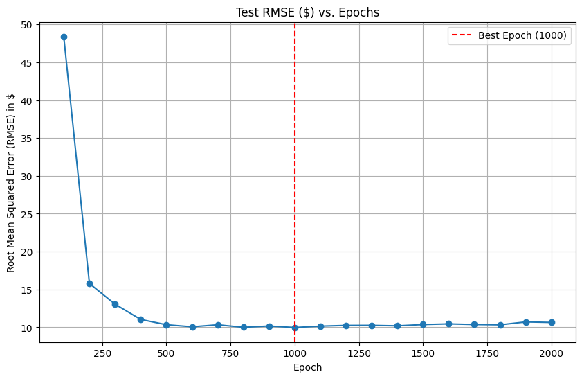

# Deep Option Pricer

## Project Overview

This project trains a deep neural network to price stock options by learning from real market data. The model is designed to capture complex market dynamics, such as the volatility smile, which classic pricing models like Black-Scholes cannot natively represent.

The primary deliverable is an interactive web application built with Streamlit. This application serves as a tool for analysis and visualization, allowing for a direct comparison between the AI's learned pricing model and live market data.




**Live Application:** [neural-vol-engine.streamlit.app](https://neural-vol-engine.streamlit.app)

---

## Key Features

* **AI-Powered Pricing Engine:** A neural network trained in PyTorch predicts option prices based on historical data.
* **Volatility Smile Visualization:** An interactive Plotly chart compares the market's true implied volatility smile against the smile learned by the AI model.
* **Automated Data Pipeline:** A data pipeline using `yfinance` and `SQLAlchemy` automatically ingests and stores daily option chain data in an SQLite database.

## Tech Stack

* **Backend & ML:** Python, PyTorch, Scikit-learn, Pandas, NumPy
* **Data:** SQLAlchemy, SQLite, yfinance
* **Frontend & Visualization:** Streamlit, Plotly
* **Testing:** Pytest

## Model Performance

The model was developed through a systematic, iterative process. To demonstrate its capabilities under different conditions, two final models were evaluated:

### Model A: Maximum Predictive Accuracy

This model uses all available features, including **Implied Volatility**, to achieve the lowest possible prediction error.

* **Best Test RMSE: $4.97**
* **Conclusion:** By using the market's own volatility forecast (IV) as a feature, this model can predict option prices with high accuracy.

### Model B: Fundamental Pricing (No Implied Volatility)

This model was intentionally given a more challenging task: predict the option price **without** seeing the implied volatility. This forces the model to learn the concept of volatility from scratch using only fundamental inputs (moneyness, time to expiry, etc.).

* **Best Test RMSE: $9.97**
* **Conclusion:** The model successfully learned the pricing function from fundamental data alone, demonstrating a robust understanding of the underlying financial principles.

#### Learning Curve (Model B)

The plot below shows the Test RMSE ($) vs. training epochs for the fundamental pricing model (Model B). The optimal performance was achieved at epoch 1000.



## Installation & Usage

1.  **Clone the repository:**
    ```bash
    git clone [https://github.com/The-H4CKER/deep-option-pricer.git](https://github.com/The-H4CKER/deep-option-pricer.git)
    cd your-repo-name
    ```

2.  **Create and activate a virtual environment:**
    ```bash
    python -m venv venv
    source venv/bin/activate  # On Windows use `venv\Scripts\activate`
    ```

3.  **Install dependencies:**
    ```bash
    pip install -r requirements.txt
    ```

4.  **Run the Streamlit application:**
    ```bash
    streamlit run app.py
    ```
